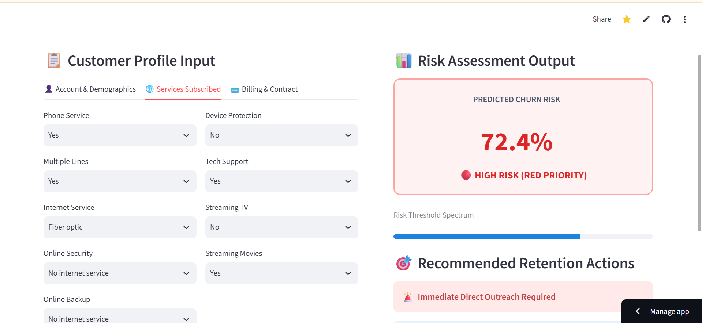
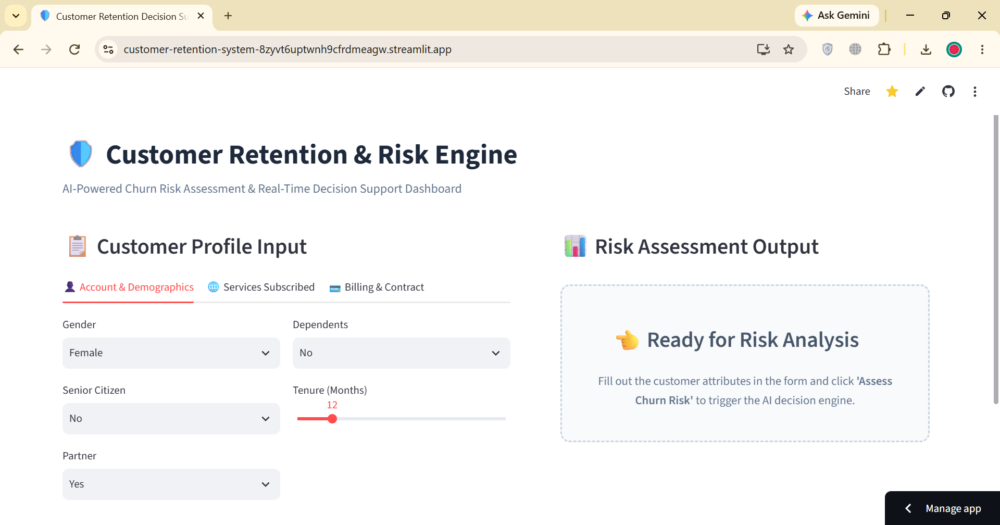

# 🛡️ Customer Retention & Decision Support System

<p align="center">
  <a href="https://customer-retention-system-8zyvt6uptwnh9cfrdmeagw.streamlit.app/">
    
  </a>
  
  
  
</p>

An end-to-end Machine Learning system that converts raw customer churn probabilities into actionable operational risk tiers, automated retention strategies, and financial ROI predictions.

<p align="center">
  🚀 <b><a href="https://customer-retention-system-8zyvt6uptwnh9cfrdmeagw.streamlit.app/">CLICK HERE TO LAUNCH LIVE INTERACTIVE DASHBOARD</a></b> 🚀
</p>

---

## 📱 Interactive Dashboard Preview

<p align="center">
  
</p>

<br>

<p align="center">
  
</p>

---

## ✨ Key Features

* **End-to-End Scikit-Learn Pipeline:** Zero data leakage preprocessing with automated column transformers for numerical and categorical attributes.
* **Risk Stratification Engine:** Converts raw probabilities into **RED (High)**, **ORANGE (Medium)**, and **GREEN (Low)** priority operational tiers.
* **Prescriptive Action Rules:** Generates tailored business retention recommendations (e.g., contract length discounts, autopay incentives).
* **ROI Decision Support:** Quantifies net saved revenue under budget-constrained customer outreach scenarios.
* **Quality Assurance (QA):** Fully covered with automated PyTest unit tests for schema validation and risk mapping.

---

## 🛠️ Tech Stack

* **Language:** Python 3.9+
* **Data Processing & ML:** Scikit-Learn, Pandas, NumPy, Joblib
* **UI & Dashboard:** Streamlit
* **Automated Testing:** PyTest
* **Version Control & CI/CD:** Git, GitHub Actions

---

## 📊 Business Impact & ROI Highlights

> **The $6,390 Bottom-Line Advantage:**
> Under a fixed outreach budget of 200 customers ($10 contact cost, $300/year retention value):

| Strategy | Actual Churners Reached | Net Saved Revenue |
| :--- | :---: | :---: |
| **Random Outreach (Baseline)** | 59 Customers | Baseline Profit |
| **ML-Prioritized Selection** | **130 Customers** | **+$6,390 Saved Revenue** |

---

## 📁 Repository Structure

```text
customer_retention_system/
├── .github/workflows/       # Automated CI/CD Testing Workflow
├── artifacts/                # Trained Pipeline (.joblib)
├── assets/                   # Dashboard Preview Screenshots
├── data/                     # Source Telco Dataset
├── notebooks/                # EDA & Exploratory Scripts
├── src/
│   ├── train_pipeline.py     # Pipeline Training & Tuning
│   └── decision_engine.py    # Risk Rules & ROI Logic
├── tests/
│   └── test_system.py        # PyTest Test Suite
├── app.py                    # Streamlit Web Application
├── requirements.txt          # Python Dependencies
└── README.md